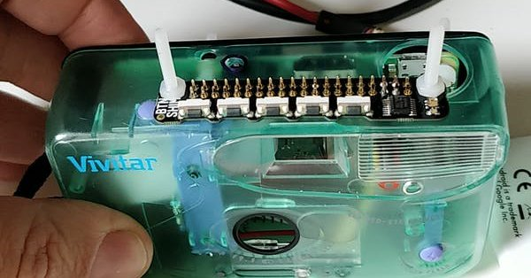

# Camera-Tell
Google Cloud Vision enabled camera that tells you what it sees

What is it?
This super-duper pimped out camera, the 'Camera Tell' enables you to take a picture and then it is analysed for you.  Then the content of the image is read out to you, for example, "the picture contains, a cat, a tree and a bike".  This started off as a fun project but as I was developing it I thought that it could be used as an aid to support people identifying where there were, what an object was and even what another person was feeling.  So I added several other functions, take a picture and you can,

1) Read the content of the image
2) Identify a landmark
3) return the emotions that people in the image are displaying
4) Identify a specific logo or brand
5) Shut down the camera!

Video here:
- https://www.youtube.com/watch?v=AMn8b3QS988

Read more at: http://www.tecoed.co.uk/google-vision-camera-tell.html